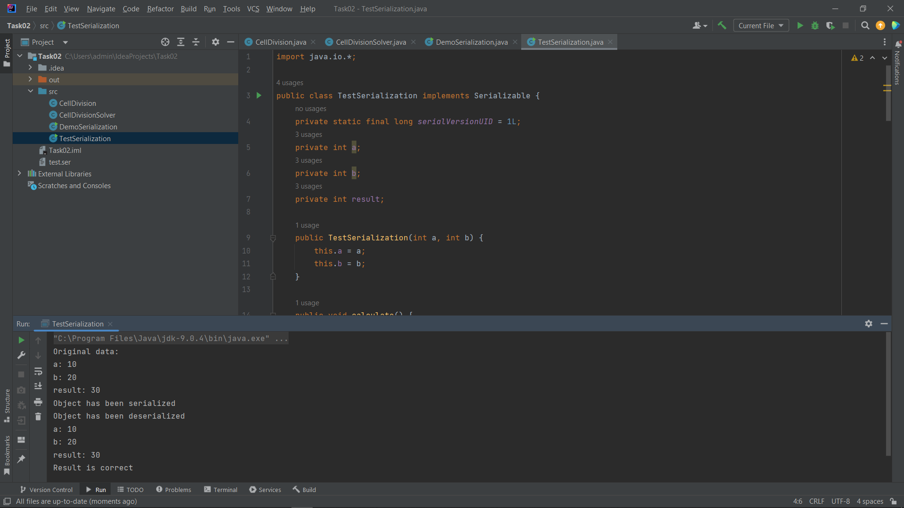
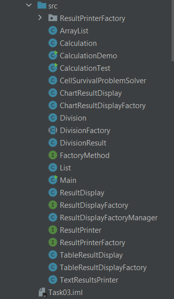

+ [TASK01](#TASK01)
+ [TASK02](#TASK02)
+ [TASK03](#TASK03)
+ [TASK04](#TASK04)
+ [TASK05](#TASK05)
+ [TASK06](#TASK06)

## TASK01:
Завдання:

Виконати розробку найпростішої консольної програми на Java, наприклад,
що виводить на екран усі аргументи командного рядка, задані при запуску
та розмістити її у локальному сховищі

#Результат запуску кода:

## TASK02:
Індивідуальне завдання:

Варіант 22

При бінарному розподілі на кожному циклі гине від 10% до 50% клітин за
сприятливих умов і від 50% до 90% – за несприятливих. Визначити кількість
клітин, що вижили, на заданому циклі поділу.

# Результат виконання програми:

## TASK03:

**Завдання:**

1. Як основа використовувати вихідний текст проекту попередньої лабораторної роботи. Забезпечити розміщення результатів обчислень уколекції з можливістю збереження/відновлення.

2. Використовуючи шаблон проектування Factory Method (Virtual Constructor), розробити ієрархію, що передбачає розширення рахунок додавання
нових відображуваних класів.

3. Розширити ієрархію інтерфейсом "фабрикованих" об'єктів, що представляє набір методів для відображення результатів обчислень.

4. Реалізувати ці методи виведення результатів у текстовому виді. Розробити та реалізувати інтерфейс для "фабрикуючого" методу.

5. Розробити клас для тестування основної функціональності.

**Результат виконання завдання:**

## TASK04:

**Завдання:**

1.Як основа використовувати вихідний текст проекту попередньої роботи.
Використовуючи шаблон проектування Factory Method (Virtual Constructor),
розширити ієрархію похідними класами, які реалізують методи представлення
результатів як текстової таблиці. Параметри відображення таблиці повинні
визначатися користувачем.
2. Продемонструвати заміщення (перевизначення, overriding), поєднання
(перевантаження, overloading), динамічне призначення методів (пізнє
зв'язування, поліморфізм, dynamic method dispatch).
3. Забезпечити діалоговий інтерфейс із користувачем.
4. Розробити клас для тестування основної функціональності.

**Результат виконання завдання:**

 

## TASK05:

**Завдання:**

1. Реалізувати можливість скасування (undo) операцій (команд).

2. Продемонструвати поняття "макрокоманда"

3. При розробці програми використовувати шаблон Singletone.

4. Забезпечити діалоговий інтерфейс із користувачем.

5. Розробити клас для тестування функціональності програми.

**Результат виконання програми:**

## TASK06:

**Завдання:**

1. Продемонструвати можливість паралельної обробки елементів колекції (пошук мінімуму, максимуму, обчислення середнього значення, відбір за критерієм, статистична обробка тощо).

2. Управління чергою завдань (команд) реалізувати за допомогою шаблону Worker Thread.

**Результат виконання програми:**

